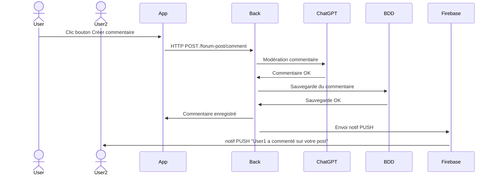
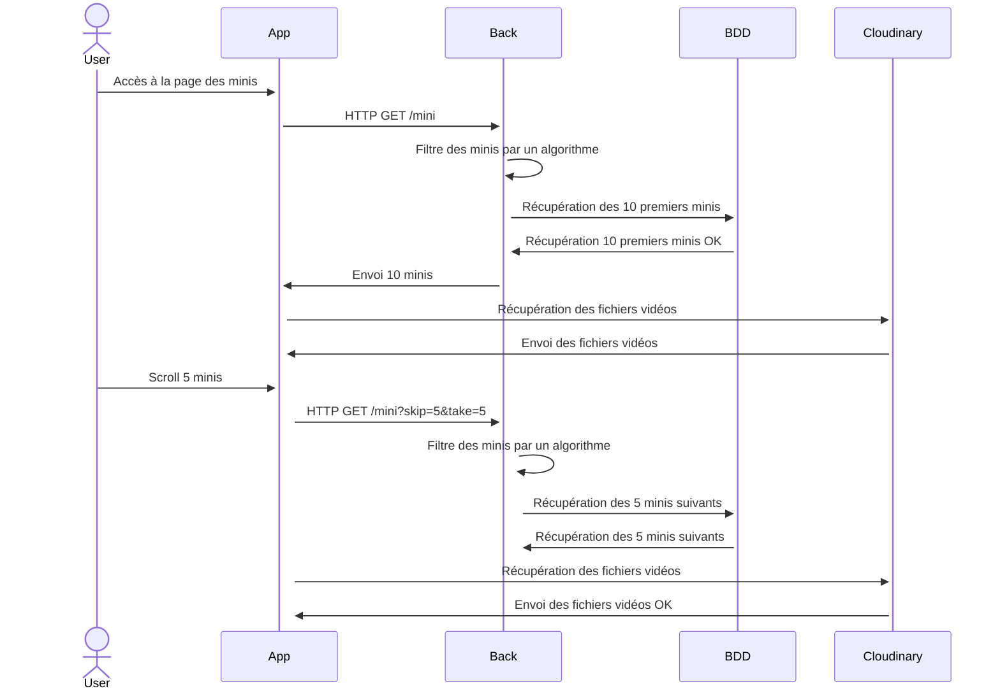
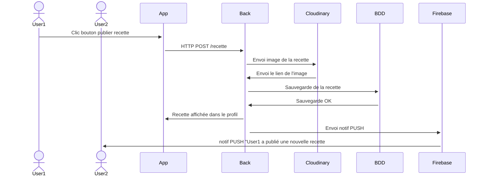
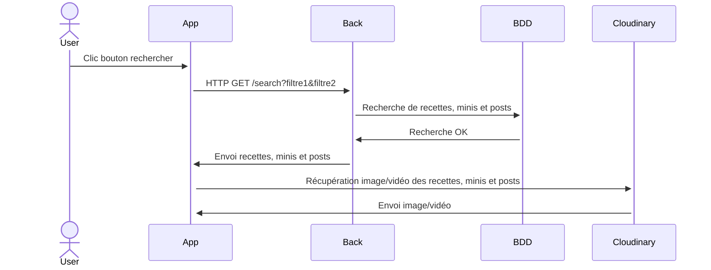

### Diagramme pour commenter un post dans le forum

```mermaid
sequenceDiagram
    actor User
    actor User2
    User->>+App: Clic bouton Créer commentaire
    App->>+Back: HTTP POST /forum-post/comment
    Back->>+ChatGPT: Modération commentaire
    ChatGPT->>+Back: Commentaire OK
    Back->>+BDD: Sauvegarde du commentaire
    BDD->>+Back: Sauvegarde OK
    Back->>+App: Commentaire enregistré
    Back->>+Firebase: Envoi notif PUSH
    Firebase->>+User2: notif PUSH "User1 a commenté sur votre post"
```

---

### Diagramme pour afficher des minis

```mermaid
sequenceDiagram
    actor User
    User->>+App: Accès à la page des minis
    App->>+Back: HTTP GET /mini
    Back->>+Back: Filtre des minis par un algorithme 
    Back->>+BDD: Récupération des 10 premiers minis
    BDD->>+Back: Récupération 10 premiers minis OK
    Back->>+App: Envoi 10 minis
    App->>+Cloudinary: Récupération des fichiers vidéos
    Cloudinary->>+App: Envoi des fichiers vidéos
    User->>+App: Scroll 5 minis
    App->>+Back: HTTP GET /mini?skip=5&take=5
    Back->>+Back: Filtre des minis par un algorithme 
    Back->>+BDD: Récupération des 5 minis suivants
    BDD->>+Back: Récupération des 5 minis suivants 
    App->>+Cloudinary: Récupération des fichiers vidéos
    Cloudinary->>+App: Envoi des fichiers vidéos OK
```

---

### Diagramme pour publier une recette

```mermaid
sequenceDiagram
    actor User1
    actor User2
    User1->>+App: Clic bouton publier recette
    App->>+Back: HTTP POST /recette
    Back->>+Cloudinary: Envoi image de la recette
    Cloudinary->>+Back: Envoi le lien de l'image
    Back->>+BDD: Sauvegarde de la recette
    BDD->>+Back: Sauvegarde OK
    Back->>+App: Recette affichée dans le profil
    Back->>+Firebase: Envoi notif PUSH
    Firebase->>+User2: notif PUSH "User1 a publié une nouvelle recette 
```

---

### Diagramme pour faire une recherche filtrée

```mermaid
sequenceDiagram
    actor User
    User->>+App: Clic bouton rechercher
    App->>+Back: HTTP GET /search?filtre1&filtre2
    Back->>+BDD: Recherche de recettes, minis et posts
    BDD->>+Back: Recherche OK
    Back->>+App: Envoi recettes, minis et posts
    App->>+Cloudinary: Récupération image/vidéo des recettes, minis et posts
    Cloudinary->>+App: Envoi image/vidéo
```