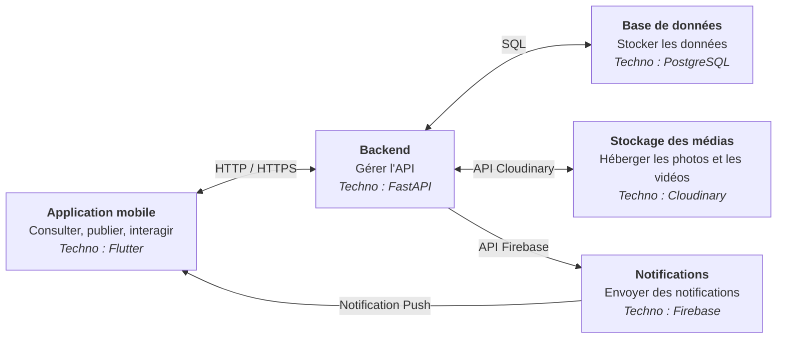

```mermaid
flowchart LR
    App["<b>Application mobile</b><br/>Consulter, publier, interagir<br/><i>Techno : Flutter"</i>]
    Backend["<b>Backend</b><br/>Gérer l'API<br/><i>Techno : FastAPI"</i>]
    DB["<b>Base de données</b><br/>Stocker les données<br/><i>Techno : PostgreSQL"</i>]
    Media["<b>Stockage des médias</b><br/>Héberger les photos et les vidéos<br/><i>Techno : Cloudinary"</i>]
    Notification["<b>Notifications</b><br/>Envoyer des notifications<br/><i>Techno : Firebase"</i>]

    App <-->|HTTP / HTTPS| Backend
    Backend <-->|SQL| DB
    Backend <-->|API Cloudinary| Media
    Backend -->|API Firebase| Notification
    Notification -->|Notification Push| App
```
